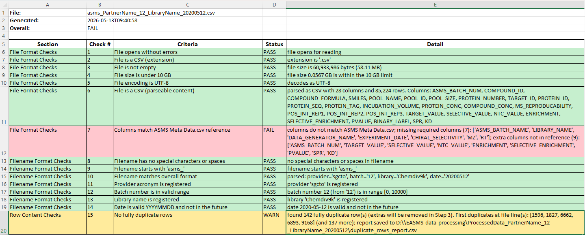

# Quality Checks

Step 0 of the pipeline. Runs a series of pre-processing validations against every raw input file **before** any data transformation. If any check returns FAIL the file is skipped and the rest of the pipeline does not run on it; WARN does not block.

This document covers what each check does, what produces a FAIL vs WARN, the supplementary report files some checks generate, and how to add new checks. For the entry point in the code, see [src/quality_check.py](src/quality_check.py).

## Outputs

For each input file, QC writes two files into `ProcessedData_<csv_basename>/`:

- **Plain text log** — `QCaircheck<YYYYMMDD>_<csv_basename>.log`, grouped by section.
- **Excel companion** — `QCaircheck<YYYYMMDD>_<csv_basename>.xlsx`, one row per check with columns `Section`, `Check #`, `Criteria`, `Status`, `Detail`. Rows are color-coded (green = PASS, red = FAIL, yellow = WARN) and the header row is frozen.

Both files contain the same information; pick whichever is easier to read.

Example of the Excel companion log:



The screenshot above shows a run where Check 7 (column-name match against `ASMS Meta Data.csv`) failed with both missing and extra columns, and Check 15 (duplicate rows) raised a WARN — the pipeline would skip this file because of Check 7, but the duplicate-row warning on its own would not have blocked it.

Some checks also produce supplementary CSVs (e.g. `FullyDuplicate_rows_report.csv`, `invalid_smiles_report.csv`, `formula_not_in_library_report.csv`, …) next to the QC logs. They are listed under the relevant check below.

## Statistics Summary

After all checks run, both the `.log` and `.xlsx` outputs include a **Statistics Summary** section so you can spot-check the dataset at a glance without opening the raw CSV. It runs whether the overall result is PASS or FAIL.

The `.log` ends with a plain-text block; the `.xlsx` has a second sheet named **Statistics**. Both contain the same three sub-sections, sourced from the QC-loaded dataframe (i.e. after fully-duplicate rows are dropped):

1. **Overview** — total rows, total columns, distinct proteins (`TARGET_ID`), distinct compounds (`COMPOUND_ID`).
2. **Per-protein breakdown** — for each `TARGET_ID`: row count and the `BINARY_LABEL=0` / `BINARY_LABEL=1` counts (label columns only appear when `BINARY_LABEL` exists in the input).
3. **Numeric column statistics** — for every numeric column (`POOL_SIZE`, `PROTEIN_CONC`, `POS_INT_REP1/2/3`, `MZ`, `RT`, …): non-null count, min, max, mean.

Excerpt of what the `.log` Statistics block looks like:

```
============================================================
Statistics Summary
============================================================

Total rows:    85,224
Total columns: 26

Distinct proteins (TARGET_ID): 8
Distinct compounds (COMPOUND_ID): 12,000

Per-protein breakdown (rows + BINARY_LABEL counts):
  TARGET_ID                                          rows    label=0    label=1
  WDR91_A4D1P6_392_747                             10,653     10,521        132
  rep_P0DTD1_5325_5925                             10,653     10,418        235
  ...

Numeric column statistics:
  Column                         non-null             min             max            mean
  POOL_SIZE                        85,224             463            1488           876.4
  POS_INT_REP1                     85,224           2,103         9.2e+09         1.4e+06
  ...
```

The summary is **defensive by design** — each section, each protein row, and each numeric column is wrapped independently, so a failure in one (e.g. a corrupted single column) only replaces that row with `(could not compute: <reason>)` and never blocks the rest. A catastrophic failure of the whole summary is captured as `(Statistics summary failed to render: <reason>)` at the bottom of the log.

## File Format Checks

1. **File opens without errors** — verifies the OS can open the file for reading.
2. **File is a CSV (extension)** — verifies the file extension is `.csv`.
3. **File is not empty** — verifies size > 0 bytes.
4. **File size is under 10 GB** — guards against accidentally pointing at something huge. Limit is `MAX_FILE_SIZE_GB` at the top of [src/quality_check.py](src/quality_check.py).
5. **File encoding is UTF-8** — reads the file in chunks and verifies it decodes cleanly with no encoding errors.
6. **File is a CSV (parseable content)** — uses `pandas.read_csv(nrows=5)` to confirm the content actually parses as CSV; reports row count, column count, and column names.
7. **Columns match `ASMS Meta Data.csv` reference** — compares the input file's column names against the canonical list in `ASMS Meta Data.csv` (see [Readme.md → Data Inputs → ASMS Meta Data.csv](Readme.md#asms-meta-datacsv)). On mismatch the log lists `missing from file: [...]` and `extra columns not in reference: [...]`.

## Filename Format Checks

Files must be named `asms_<provider>_<batch>_<library>_<YYYYMMDD>.csv` (e.g. `asms_acmecorp_01_Chemdiv_9k_20260512.csv`).

8. **Filename has no special characters or spaces** — only `[A-Za-z0-9_.-]` allowed.
9. **Filename starts with `asms_`**.
10. **Filename matches overall format** — must parse as `asms_<provider>_<batchN>_<library>_<YYYYMMDD>.csv`.
11. **Provider acronym is registered** — the `<provider>` token must appear in the `acronym` column of `Providers.csv` (see *Providers config* below).
12. **Batch number is in valid range** — integer between `MIN_BATCH_NUMBER` (0) and `MAX_BATCH_NUMBER` (10000). Leading zeros are allowed (`01`, `0100`).
13. **Library name is registered** — the `<library>` token must match the filename stem of a file in `MasterLists/` (excluding `MasterList_Information.xlsx`).
14. **Date is valid `YYYYMMDD` and not in the future** — parsed with `datetime.strptime`; must be ≤ today.

## Row Content Checks

15. **No fully duplicate rows** — uses `pandas.DataFrame.duplicated(keep="first")` to detect rows where every column value matches an earlier row. Reports the count and the file line numbers (1-indexed, including the header row) of the first few duplicates.
    - **Severity: WARN, not FAIL.** Duplicate rows do *not* block the pipeline — they are removed later by Step 3 (anomaly_selection), which calls `df.drop_duplicates()`.
    - When duplicates are found, the check writes `FullyDuplicate_rows_report.csv` containing every row that is part of a duplicate group (all copies, not just the dropped ones) with a leading `FileLine` column indicating the 1-indexed line in the source CSV.

## Column Content Checks

Before running these, the orchestrator reads the file once and drops fully-duplicate rows (the same rows Check 15 flagged), so column-content checks see the cleaned data — not the raw file. This is QC-internal only; the actual pipeline's Step 3 still does its own `drop_duplicates()` on the unmodified input.

### `COMPOUND_ID`

16. **COMPOUND_ID is string (VARCHAR)** — every non-null value must be a Python `str`. WARN if any non-string values are found (pandas may auto-cast numeric-looking IDs to int, which is worth flagging but not necessarily fatal).
17. **COMPOUND_ID has no leading/trailing whitespace** — FAIL if any value starts or ends with a space or tab; whitespace tends to break joins against `MasterLists/` later.
18. **COMPOUND_ID has no null values** — FAIL if any row's COMPOUND_ID is `NaN`.
19. **COMPOUND_ID is unique within each TARGET_ID** — assumes each molecule is tested at most once per target. If duplicates exist (same `TARGET_ID`, same `COMPOUND_ID`, but the rows differ in some other column — otherwise Check 15 would have caught them), the check WARNs and writes one report CSV per offending target: `duplicate_COMPOUND_ID_per_TARGET_ID_<TARGET_ID>.csv` (filename is sanitized to alphanumerics + `_.-`).

### `SMILES`

QC runs *before* Step 4 (isomer handling), so SMILES values may still be `;`-separated isomer groups (e.g. `"CC;CCC"`). Checks 23 and 24 split on `;` and validate / match each component independently, so isomer rows don't false-fail.

20. **SMILES is string (VARCHAR)** — every non-null value must be a Python `str`. WARN.
21. **SMILES has no leading/trailing whitespace** — FAIL; matches against the library are exact-string matches.
22. **SMILES has no null values** — FAIL.
23. **SMILES is valid (non-empty, RDKit-parseable)** — FAIL when any row is empty or any isomer component fails `rdkit.Chem.MolFromSmiles`. Writes `invalid_smiles_report.csv` with the offending rows and an `Issue` column (`empty` or `malformed: '<part>'`).
24. **SMILES is in the associated library** — WARN. Resolves the library for this raw CSV via `MasterList_Information.xlsx` (FileName → MaterListName → `<MaterListName>.xlsx`), loads its `SMILES` column, and checks every input SMILES (or isomer component) against it. Writes `smiles_not_in_library_report.csv` with each offending row and a `MissingPart` column showing which component wasn't found. This check FAILs (not WARNs) if the library could not be located at all — that's a configuration error.
25. **SMILES is unique within each TARGET_ID** — WARN. Same idea as Check 19 but on SMILES: if the same molecule appears more than once for the same target, a per-target report is written: `duplicate_SMILES_per_TARGET_ID_<TARGET_ID>.csv`.

### `ASMS_BATCH_NAME`

Each raw file represents exactly one batch, so every row should share the same `ASMS_BATCH_NAME` value, formatted as `<provider>_<batch_number>` (e.g. `sgcto_01`) where `<provider>` is one of the acronyms registered in `Providers.csv`.

26. **ASMS_BATCH_NAME is string (VARCHAR)** — WARN if any non-string values.
27. **ASMS_BATCH_NAME has no leading/trailing whitespace** — FAIL.
28. **ASMS_BATCH_NAME has no null values** — FAIL.
29. **ASMS_BATCH_NAME is consistent across all rows** — FAIL when more than one distinct value appears in the column (one raw file should encode exactly one batch).
30. **ASMS_BATCH_NAME follows `<provider>_<batch_number>`** — FAIL when a value does not match the regex `^[A-Za-z]+_\d+$` or when its provider segment is not in the loaded `Providers.csv` list. Lists the offending values (up to five) in the log message.

### `COMPOUND_FORMULA`

The library file uses the column name `formula` (lowercase, though the lookup is case-insensitive so `Formula` / `FORMULA` also work). Isomer rows in the input may have `;`-separated SMILES *and* `;`-separated COMPOUND_FORMULA — the matching check pairs the two component-by-component.

31. **COMPOUND_FORMULA is string (VARCHAR)** — WARN.
32. **COMPOUND_FORMULA has no leading/trailing whitespace** — FAIL.
33. **COMPOUND_FORMULA has no null values** — FAIL.
34. **COMPOUND_FORMULA is in the associated library** — WARN. Checks set membership: every formula in `COMPOUND_FORMULA` (or each component when the value is `;`-separated) must appear in the `formula` column of the associated library. When some don't, the check writes `formula_not_in_library_report.csv` with the offending rows plus a leading `MissingFormula` column showing which component wasn't found. FAILs (instead of WARNing) only when the library itself cannot be located.

### `POOL_NAME`

35. **POOL_NAME is string (VARCHAR)** — WARN.
36. **POOL_NAME has no leading/trailing whitespace** — FAIL.
37. **POOL_NAME has no null values** — FAIL.

### `POOL_ID`

38. **POOL_ID is string (VARCHAR)** — WARN.
39. **POOL_ID has no leading/trailing whitespace** — FAIL.
40. **POOL_ID has no null values** — FAIL.

### `POOL_SIZE` (INT)

41. **POOL_SIZE is integer (INT)** — WARN. Accepts either an integer dtype, or a float dtype whose non-null values are all whole numbers (pandas downcasts to float as soon as one NaN appears, so this is common).
42. **POOL_SIZE is in valid range [400, 1500]** — FAIL. Bounds are configurable via `POOL_SIZE_MIN` / `POOL_SIZE_MAX` at the top of [src/quality_check.py](src/quality_check.py). The detail message reports both out-of-range values and any cells that couldn't be parsed as numbers.
43. **POOL_SIZE has no null values** — FAIL.

### `TARGET_ID`

`TARGET_ID` must follow `<name>_<UniprotID>_<startAA>_<endAA>` (e.g. `WDR91_A4D1P6_392_747`). The Uniprot_ID segment is **not yet validated against a registry** — see the TODO at the bottom of the TARGET_ID block in [src/quality_check.py](src/quality_check.py); a check function and the wiring instructions are sketched there for when a list of valid Uniprot_IDs becomes available.

44. **TARGET_ID is string (VARCHAR)** — WARN.
45. **TARGET_ID has no leading/trailing whitespace** — FAIL.
46. **TARGET_ID has no null values** — FAIL.
47. **TARGET_ID matches `<name>_<UniprotID>_<start>_<end>`** — FAIL. Regex: `^[A-Za-z0-9]+_[A-Za-z0-9]+_\d+_\d+$`. Lists up to five offending values in the log message.
48. **TARGET_ID start < end (and both numeric)** — FAIL. Parses the two trailing digit groups as integers and verifies `start < end` for every unique TARGET_ID that matched the format.
49. **All TARGET_IDs have the same number of compounds** — WARN. Each batch is expected to test the same library against every target, so all TARGET_IDs should appear with identical `COMPOUND_ID` counts. When counts differ the detail reports min, max, and the distinct counts observed.

### `PROTEIN_NUMBER` (INT)

A number associated with each protein in the batch. In a batch of 8 proteins, the values are integers `1, 2, …, 8`; in a 5-protein batch they would be `1, 2, …, 5`. The check is flexible on **N** (the batch size) but expects the distinct values to be exactly `{1, 2, …, N}`.

50. **PROTEIN_NUMBER is integer (INT)** — WARN.
51. **PROTEIN_NUMBER has no null values** — FAIL.
52. **PROTEIN_NUMBER values form `{1, 2, ..., N}`** — WARN. PASSes when the distinct values are exactly the integers 1..N for whatever N is observed in the file. Any deviation (fewer, more, gaps, off-by-one start, non-integer values, unparseable values) WARNs and the detail message lists the actual distinct values plus the expected `{1..N}` set so you can see what's off.

### `PROTEIN_ID`

`PROTEIN_ID` holds the Uniprot ID of the protein. Each `TARGET_ID` represents one protein region, so all rows sharing a `TARGET_ID` must also share the same `PROTEIN_ID`.

53. **PROTEIN_ID is string (VARCHAR)** — WARN.
54. **PROTEIN_ID has no leading/trailing whitespace** — FAIL.
55. **PROTEIN_ID has no null values** — FAIL.
56. **PROTEIN_ID is consistent within each TARGET_ID** — FAIL. Groups rows by `TARGET_ID` and counts distinct `PROTEIN_ID` values per group; if any group has more than one, the row group is flagged. The detail message lists up to five offending targets along with the conflicting PROTEIN_ID values seen.

### `INCUBATION_VOLUME` (FLOAT)

`INCUBATION_VOLUME` is the incubation volume used in the run, in µL.

57. **INCUBATION_VOLUME is numeric (FLOAT)** — WARN. Accepts any numeric dtype, or string values that all coerce cleanly to numbers.
58. **INCUBATION_VOLUME values are positive (> 0)** — FAIL. Reports both non-positive values and any cells that couldn't be parsed as numbers.
59. **INCUBATION_VOLUME has no null values** — FAIL.

> **Placeholder, not yet active**: a check for "within realistic experimental range" is sketched as a commented-out block in [src/quality_check.py](src/quality_check.py) right above the active INCUBATION_VOLUME checks. When the realistic uL range is decided, set `INCUBATION_VOLUME_MIN` / `INCUBATION_VOLUME_MAX`, uncomment the function, and add it to the SECTIONS list.

### `PROTEIN_CONC` (FLOAT)

`PROTEIN_CONC` is the protein concentration used in the run, in µM. The experimental protocol fixes it at `PROTEIN_CONC_EXPECTED = 1.0` µM (the constant lives at the top of the PROTEIN_CONC block in [src/quality_check.py](src/quality_check.py); change it if the protocol uses a different fixed value).

60. **PROTEIN_CONC is numeric (FLOAT)** — WARN.
61. **PROTEIN_CONC equals expected value (1.0)** — FAIL. Uses a small floating-point tolerance (`atol = 1e-9`) so values like `1.0000000001` still pass. The detail message reports both non-matching values and any cells that couldn't be parsed as numbers.
62. **PROTEIN_CONC has no null values** — FAIL.

> **Placeholder, not yet active**: a check for "within realistic experimental range" is sketched as a commented-out block in [src/quality_check.py](src/quality_check.py) right above the active PROTEIN_CONC checks. When the realistic µM range is decided, set `PROTEIN_CONC_MIN` / `PROTEIN_CONC_MAX`, uncomment the function, and add it to the SECTIONS list.

### `COMPOUND_CONC` (FLOAT)

`COMPOUND_CONC` is the compound concentration used in the run, in µM.

63. **COMPOUND_CONC is numeric (FLOAT)** — WARN.
64. **COMPOUND_CONC values are positive (> 0)** — FAIL. Reports both non-positive values and any cells that couldn't be parsed as numbers.
65. **COMPOUND_CONC has no null values** — FAIL.

### `MS_REPRODUCABILITY` (BOOL)

66. **MS_REPRODUCABILITY is boolean (BOOL)** — WARN. Verifies the pandas dtype is `bool`.
67. **MS_REPRODUCABILITY only contains True/False** — FAIL. Set-membership against `{True, False}`. Catches accidental string `"True"`/`"False"` or numeric 0/1 values that may slip in with object-dtype columns.
68. **MS_REPRODUCABILITY has no null values** — FAIL.

### `POS_INT_REP1` / `POS_INT_REP2` / `POS_INT_REP3` (FLOAT, peak intensity per replicate)

Threshold `POS_INT_REP_MIN = 0` lives at the top of the POS_INT_REP block in [src/quality_check.py](src/quality_check.py); change it once to update all three replicates.

69. **POS_INT_REP1 is numeric (FLOAT)** — WARN.
70. **POS_INT_REP1 values are >= 0** — FAIL. Reports up to five offending values plus any cells that couldn't be parsed as numbers.
71. **POS_INT_REP1 has no null values** — FAIL.
72. **POS_INT_REP2 is numeric (FLOAT)** — WARN.
73. **POS_INT_REP2 values are >= 0** — FAIL.
74. **POS_INT_REP2 has no null values** — FAIL.
75. **POS_INT_REP3 is numeric (FLOAT)** — WARN.
76. **POS_INT_REP3 values are >= 0** — FAIL.
77. **POS_INT_REP3 has no null values** — FAIL.

### `BINARY_LABEL` (INT)

`BINARY_LABEL` is `1` if significantly enriched, `0` otherwise.

78. **BINARY_LABEL is integer (INT)** — WARN. Accepts integer dtype, or float dtype whose non-null values are all whole numbers.
79. **BINARY_LABEL only contains {0, 1}** — FAIL. Set-membership against `{0, 1}`. Lists up to five offending values.
80. **BINARY_LABEL has no null values** — FAIL.

### `LIBRARY_NAME`

The library name in this column must be a single alphanumeric token (e.g. `EASMS12kV1`) — **no underscores, no spaces** — and must match one of the library filename stems found in `MasterLists/`. Each file represents one library, so all rows must share the same value.

81. **LIBRARY_NAME is string (VARCHAR)** — WARN.
82. **LIBRARY_NAME has no leading/trailing whitespace** — FAIL.
83. **LIBRARY_NAME has no null values** — FAIL.
84. **LIBRARY_NAME is alphanumeric (no underscores/spaces)** — FAIL. Regex: `^[A-Za-z0-9]+$`.
85. **LIBRARY_NAME is registered** — FAIL. Each value must match a filename stem in `MasterLists/` (`MasterList_Information.xlsx` excluded). Uses the same `libraries` context as filename Check 13.
86. **LIBRARY_NAME is consistent across all rows** — FAIL when more than one distinct value appears in the column.

### `DATA_GENERATOR_NAME`

Must be exactly one of the registered data-generator names listed in `Providers.csv` under the `data_generator_name` column (e.g. `ASMS_SGC_TORONTO`, `ASMS_NUVISAN_GERMANY`, `ASMS_AZ_UK`).

87. **DATA_GENERATOR_NAME is string (VARCHAR)** — WARN.
88. **DATA_GENERATOR_NAME has no leading/trailing whitespace** — FAIL.
89. **DATA_GENERATOR_NAME has no null values** — FAIL.
90. **DATA_GENERATOR_NAME is registered (in Providers.csv)** — FAIL. Each value must appear in the `data_generator_name` column of `Providers.csv`.
91. **DATA_GENERATOR_NAME is consistent across all rows** — FAIL when more than one distinct value appears (each file should encode exactly one data generator).

### `EXPERIMENT_DATE`

Date format `YYYYMMDD` (e.g. `20260513`).

92. **EXPERIMENT_DATE is string (VARCHAR)** — WARN.
93. **EXPERIMENT_DATE has no leading/trailing whitespace** — FAIL.
94. **EXPERIMENT_DATE has no null values** — FAIL.
95. **EXPERIMENT_DATE is valid YYYYMMDD and not in the future** — FAIL. Parses with `datetime.strptime("%Y%m%d")`; rejects bad formats *and* dates that fall after today.

### `CHIRAL_SELECTIVITY`

Allowed values (case-sensitive): `achiral`, `chiral_selective`, `chiral_not_selective`, `chiral_undetermined`. Edit the `CHIRAL_SELECTIVITY_ALLOWED` set in [src/quality_check.py](src/quality_check.py) to change the allowed list.

96. **CHIRAL_SELECTIVITY is string (VARCHAR)** — WARN.
97. **CHIRAL_SELECTIVITY has no leading/trailing whitespace** — FAIL.
98. **CHIRAL_SELECTIVITY has no null values** — FAIL.
99. **CHIRAL_SELECTIVITY is one of the allowed values** — FAIL. Set-membership against `CHIRAL_SELECTIVITY_ALLOWED`. Lists up to five offending values in the log message.

### `MZ` (FLOAT, mass-to-charge ratio)

100. **MZ is numeric (FLOAT)** — WARN.
101. **MZ is in valid range [150, 600]** — FAIL. Inclusive on both ends; bounds are `MZ_MIN` / `MZ_MAX` at the top of the MZ block in [src/quality_check.py](src/quality_check.py).
102. **MZ has no null values** — FAIL.

### `RT` (FLOAT, retention time in minutes)

103. **RT is numeric (FLOAT)** — WARN.
104. **RT is in valid range (0, 6) exclusive** — FAIL. **Strictly** greater than 0 and **strictly** less than 6 (so `0` and `6` themselves both fail). Bounds are `RT_MIN` / `RT_MAX` at the top of the RT block in [src/quality_check.py](src/quality_check.py).
105. **RT has no null values** — FAIL.

### `PROTEIN_SEQ` (amino-acid sequence)

The protein sequence must be longer than 6 characters. Threshold lives at `PROTEIN_SEQ_MIN_LENGTH = 6` near the top of the PROTEIN_SEQ block in [src/quality_check.py](src/quality_check.py); bump it if you want a stricter minimum.

106. **PROTEIN_SEQ is string (VARCHAR)** — WARN.
107. **PROTEIN_SEQ has no leading/trailing whitespace** — FAIL.
108. **PROTEIN_SEQ has no null values** — FAIL.
109. **PROTEIN_SEQ length > 6** — FAIL. Strictly greater than 6 characters (so a 7-character sequence passes, 6 fails). Lists up to five offending values.

### `PROTEIN_TAG` (anchoring tag — e.g. `N_his`, `C_his`)

110. **PROTEIN_TAG is string (VARCHAR)** — WARN.
111. **PROTEIN_TAG has no leading/trailing whitespace** — FAIL.
112. **PROTEIN_TAG has no null values** — FAIL.

## Providers config

The list of valid provider acronyms is loaded from `Providers.csv` inside `--input-dir` (next to `RawData/`). Expected format:

```csv
acronym,name,data_generator_name
acmecorp,Acme Corp Research Labs,ASMS_ACME_CORP
fakelab,FakeLab Pharmaceuticals Inc,ASMS_FAKELAB
genericrx,GenericRx Therapeutics,ASMS_GENERICRX
```

- `acronym` is used by filename Check 11 (the `<provider>` segment of the raw CSV filename) and the `ASMS_BATCH_NAME` format check.
- `data_generator_name` is used by column Check 90 (the `DATA_GENERATOR_NAME` column in the raw CSV must match one of these exact strings).

The real `Providers.csv` is gitignored (private company info). A fake version with placeholder names lives at [Providers_sample.csv](Providers_sample.csv) — copy it into your `--input-dir` as `Providers.csv` and replace the entries with the real acronyms and data-generator names.

## Extending

Add more checks by appending a `(description, function)` tuple to one of the `SECTIONS` entries in [src/quality_check.py](src/quality_check.py). Each function takes `file_path, **context` and returns either:

- `(passed: bool, message: str)` — short form. `passed=True` → PASS, `passed=False` → FAIL.
- `(passed: bool, message: str, status: str)` — long form. `status` is one of `"PASS"`, `"FAIL"`, `"WARN"`. Use `"WARN"` for issues that should be reported in the log but should not block the pipeline (e.g. duplicate rows that downstream steps will clean up).

The orchestrator passes the following keys via `context`:

- `providers` — list of valid provider acronyms loaded from `Providers.csv`
- `data_generators` — set of valid data-generator names from the `data_generator_name` column of `Providers.csv`
- `libraries` — list of registered library names (filename stems from `MasterLists/`)
- `meta_columns` — list of canonical column names from `ASMS Meta Data.csv`
- `output_dir` — the same folder as the log file (useful for writing supplementary report CSVs)
- `df` — the input CSV pre-loaded as a `pandas.DataFrame` with fully-duplicate rows dropped (for column-content checks). Will be `None` if the file could not be parsed.
- `masterlist_dir` — path to the `MasterLists/` folder, for checks that need to load a specific library file via `MasterList_Information.xlsx`.
